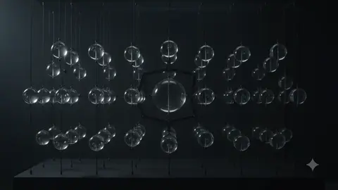
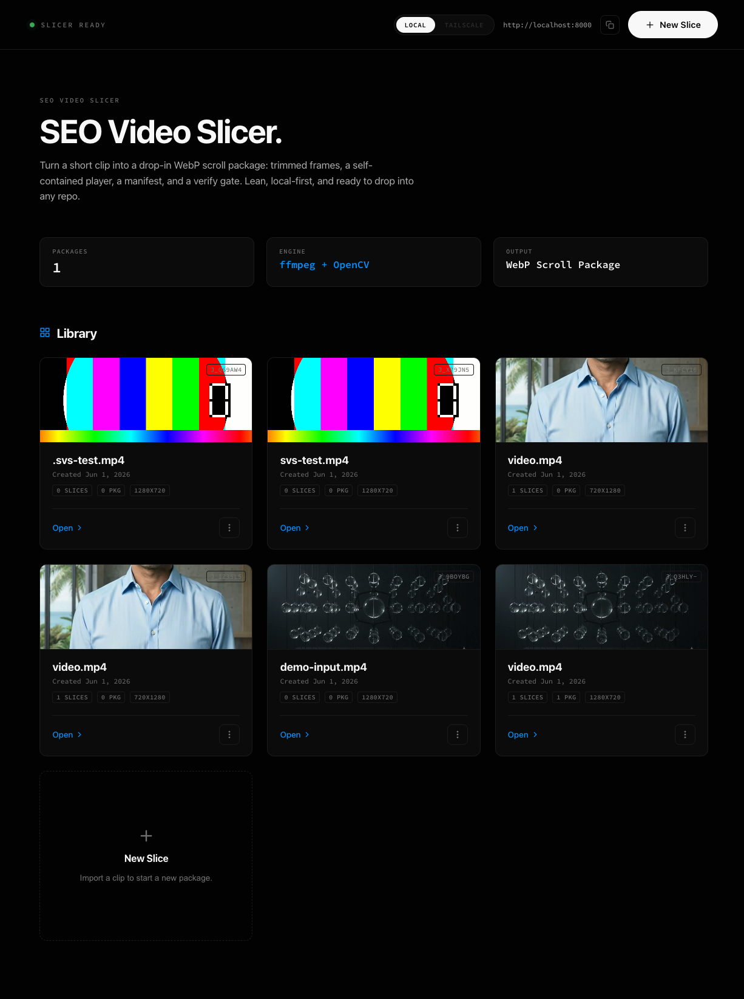
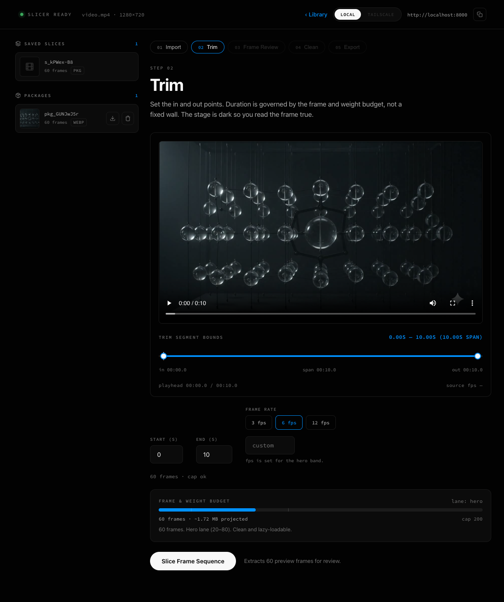

<div align="center">

# SEO Video Slicer

**Turn a short video into a drop-in WebP animation package — so your AI assistant ships premier scroll motion without burning tokens drawing it from scratch.**

[](https://github.com/ehukaimedia/seo-video-slicer/actions/workflows/ci.yml)
[](LICENSE)
[](CODE_OF_CONDUCT.md)
[](CONTRIBUTING.md)


<br/>



<sub>This looping preview <em>is</em> an animated WebP — exactly the kind of asset the slicer ships. ~1&nbsp;MB, lazy-loadable, CLS-free.</sub>

</div>

---

## The idea

Asking a frontier model to *generate* hero imagery from scratch is slow, expensive, and non‑deterministic — it burns a pile of tokens and you still might not get usable motion. **Flip it.** You already have a video (Veo, a screen capture, a product shot). Slice it into a tiny, optimized WebP frame sequence and hand your repo's model a **ready‑to‑go animation package**. The model spends near‑zero image tokens and gets enterprise‑grade scroll motion on the first pass.

**The package is the product.** This tool is the premium slicer that produces it.

```
your video  ──▶  trim · clean · slice  ──▶  drop-in WebP package  ──▶  any repo
                                              (frames + working player
                                               + manifest + verify gate)
```

## What you get out

Every export is a **self‑contained folder that opens and animates with no server, no build step, and zero external requests**:

```
<slug>-animation/
├── frames/            frame_000.webp … frame_NNN.webp   (zero-padded, lazy-loadable)
├── index.html         a scroll-driven canvas player — open it, it animates now
├── manifest.json      source meta + locked vs. customizable zones + tamper fingerprint
├── verify.mjs         offline quality gate (Node, zero deps) — G1…G7
├── README.md          iframe / React / vanilla integration recipes
└── PROMPT.md          optional one-paragraph brief for a downstream LLM
```

Drop it into `public/`, embed the iframe (or adapt the player into a component), and you're done. `node verify.mjs` proves the package is intact and self‑contained.

**See a real one:** [`example/sample-package/`](example/sample-package) is a committed, gate-passing export — open its `index.html` and scroll.

## Why it's good for SEO / Core Web Vitals

WebP frame sequences are **LCP‑safe, lazy‑loadable, and CLS‑free** — a fraction of the weight of shipping video or a heavy JS animation library. A typical 10s hero clip lands around **40–60 frames / ~2 MB**. The package is engineered to *help* Core Web Vitals, not hurt them.

## Screenshots

| Library (manage your slices & packages) | Slicer (dark grading studio) |
|---|---|
|  |  |

A dark, technical instrument: Void‑Black canvas, one Electric‑Blue accent, frames graded against neutral darkness (the Premiere/Resolve standard).

## Quickstart

🔴 **Live demo:** watch a real exported package animate at **[ehukaimedia.github.io/seo-video-slicer](https://ehukaimedia.github.io/seo-video-slicer/)** — a static page running the actual scroll-player (the slicer itself stays local).

**Requirements:** [ffmpeg](https://ffmpeg.org/) and [Node](https://nodejs.org/) 18+ on your PATH (the media tools + the package kernel); Python 3.10+ for the clone path. (Premium neural erase is optional and never auto‑installed.)

### Run without cloning — `uvx`

No clone, no Docker, no server to host. Grab the wheel URL from the [latest release](https://github.com/ehukaimedia/seo-video-slicer/releases/latest), then:

```bash
uvx --from <release-wheel-url> seo-video-slicer    # → http://localhost:8000
```

The wheel bundles the built UI and the package kernel; you just need `ffmpeg` and `node` on PATH. Set `SVS_PORT` to change the port; your slices land in `~/.seo-video-slicer/`.

### Or clone and run

```bash
git clone https://github.com/ehukaimedia/seo-video-slicer.git
cd seo-video-slicer

./start.command          # macOS  (double-click works too)
bash start.sh            # Linux / macOS
make setup && make run   # any platform with make
```

Each launcher sets up the venv, builds the UI, and starts the server. Then open **http://localhost:8000**. It also prints your **LAN** and **Tailscale** URLs so you can drive it from another device.

<details>
<summary>Manual launch (Linux / Windows)</summary>

```bash
# backend
python3 -m venv .venv --system-site-packages
.venv/bin/pip install -r backend/requirements.txt

# frontend (built once, served by the backend)
cd frontend && npm install && npm run build && cd ..

# run
cd backend && SVS_PORT=8000 ../.venv/bin/python -m uvicorn app.main:app --host 0.0.0.0 --port 8000
```
</details>

## How it works

1. **Import** — drop any MP4 / MOV / WebM.
2. **Trim** — set in/out on a dark stage; pick fps. A live **frame & weight budget meter** keeps you in the Core‑Web‑Vitals sweet spot (default 10s, configurable to 60).
3. **Frame Review** — filmstrip with per‑frame exclude + a pixel‑peeping lightbox.
4. **Clean** — auto/manual crop (with a watermark‑symmetry enforcer) and region erase (two‑tier: OpenCV `INPAINT_NS` baseline always available; LaMa neural inpaint when installed).
5. **Export** — assemble the package, run `verify.mjs` (G1–G7), download, and grab the share URL. Manage past slices and packages from the **Library**.

### The package contract

The package layout, the `index.html` player techniques (cover‑fit single canvas, DPR scaling, parallel preload, `prefers-reduced-motion`, a stable `data-template-id`), the `manifest.json` schema, the fingerprint recipe, and the seven verify gates are **frozen** in [`package-contract/CONTRACT.md`](package-contract/CONTRACT.md). The packager and `verify.mjs` are built to it — and the kernel is covered by negative‑corruption tests (break a frame, leak a URL, tamper the fingerprint → the matching gate fails).

## Tech stack

- **Backend** — Python · FastAPI · ffmpeg · OpenCV · Pillow. Serves the built UI on a single process.
- **Frontend** — Vite · React · TypeScript. A single‑page dark studio.
- **Package kernel** — Node, zero‑dependency (`verify.mjs`, `build_package.mjs`).
- **No** local LLM, no animation generator, no chat. Lean by construction.

## Project layout

```
backend/app/        FastAPI: upload, slice, crop, two-tier erase, packager, share, management
frontend/src/       the "Dark Instrument" slicer UI
package-contract/   the frozen package kernel (CONTRACT.md, player template, verify.mjs, build_package.mjs)
docs/               spec, plan, architecture playground, assets
DESIGN.md           the design system of record ("The Dark Instrument")
PRODUCT.md          who it's for and why
```

## Status & roadmap

Alpha — the full pipeline works end‑to‑end (verified on real footage). On the way to a polished 1.0:

- [x] CI (GitHub Actions) running the `pytest` backend suite, the kernel `verify.mjs` test, and the frontend build
- [x] A curated example package + an animated demo
- [x] Cross‑platform launch (`start.sh`, `Makefile`)
- [x] Spec + architecture playground on the current dark design system
- [x] `uvx` zero‑clone launch (a wheel with the UI bundled, attached to each release)
- [x] A static live demo on GitHub Pages

## Contributing

Contributions are welcome — issues, PRs, and docs. The quick loop:

```bash
make setup     # venv + deps + npm install
make test      # backend pytest + kernel verify
make build     # build the UI
make run       # start the app on localhost:8000
```

Read **[CONTRIBUTING.md](CONTRIBUTING.md)** for setup, the frozen package contract, the design system, and the PR process. By participating you agree to the **[Code of Conduct](CODE_OF_CONDUCT.md)**. To report a vulnerability, see **[SECURITY.md](SECURITY.md)**. Notable changes are tracked in the **[CHANGELOG](CHANGELOG.md)**.

## License

[MIT](LICENSE) © 2026 ehukaimedia.

The design system is documented in [`DESIGN.md`](DESIGN.md); its visual language is adapted from the author's own *smart-image-animations* studio.
